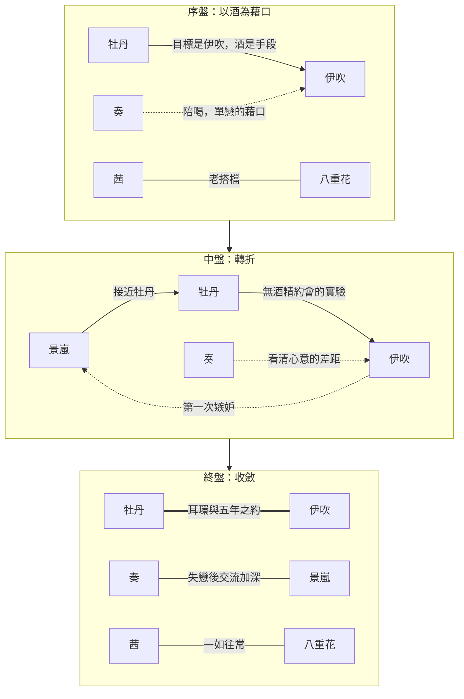

> **有雷警告：本篇完整劇透動畫全 12 話，含結局。**

---

《上伊那牡丹，醉姿如百合》是 2026 年 4 月的春番，改編自塀在秋田書店「Champion Cross」連載的同名漫畫，由做過《mono》的新銳工作室 Soigne 製作。故事的舞台是一棟老洋房改的大學女生宿舍：剛滿 20 歲的長野新生上伊那牡丹搬了進來，和宿舍長礪波伊吹，以及一群個性各異的舍友，展開了「每一集認識一種酒」的日常。

*故事的舞台，牡丹入住的學生宿舍。Photo Credit：TV 動畫本篇*

說是日常，其實平淡得近乎「無聊」：上課、打工、回宿舍，然後在誰的房間裡開一瓶酒。就是大學生最普通甚至不美的日常，喝中國勁酒，摳大學室友，不就是如此嗎？是這樣沒錯，但不是這樣。

*Photo Credit：網路流傳梗圖*

這部作品對酒的描繪，幾乎是童話式的。沒有壞人的世界，遠離工作與家庭的重量，盡情沉浸在微醺的夢幻國度裡嬉遊；既沒有凡間飲酒常見的宿醉、嘔吐或大鬧場面，也沒有酒後失言、糾纏不清而讓關係出現裂痕的修羅場，加上優秀的分鏡和作畫，酒被塑造成了連結人心的潤滑劑。正是為了追尋它所帶來的幸福導致的變化，以此作為故事的主題。

宿舍裡的感情線也不只一條：學姊郡上奏對伊吹積年的單戀、遊佐茜和北杜八重花這對老搭檔、中途闖入的台灣留學生張景嵐，每條線都有自己的戲份。整季看下來，配對關係大致是這樣流動的：

不過這篇不打算每條線都展開，想談的是牡丹和伊吹的主線，尤其是後半段。

## 喝得那麼香的人，讓人想坐到她身邊

剛滿 20 歲的人，對大人的世界總有一種微妙的憧憬。在秩父的芝櫻祭上，這份憧憬在牡丹眼前有了具體的形狀：賞花的人潮外，一個獨自把 Highball 喝得津津有味的女人。酒是大人世界的東西，伊吹也是，而且伊吹排在前面。牡丹湊過去討的那一口，與其說是想知道酒的味道，不如說是想知道站在這個人身邊是什麼感覺，喝酒只是最順手的方法。

*第 1 話，芝櫻祭上的牡丹。Photo Credit：TV 動畫官方網站*

兩人的關係打從一開始就不對稱。伊吹因為過去的苦澀經驗，長年執著於獨酌，酒對她是一個人的避難所；牡丹則是徹底的新人，酒對她是通往伊吹的門票。同樣是喝酒，兩個人要的東西完全不同。

所以從第一天起，主動的一方就是牡丹。約伊吹出來喝酒的是她，在服飾店起意做配對耳環的是她，把寫著兩人名字的紙條奉納到神社的也是她。每一集嘗試一種新的酒，每一種酒都是一次新的約會藉口，關係的推進速度和酒精濃度成正比。而一直獨酌的伊吹，也在看著牡丹喝得開心的樣子時，慢慢生出「想和這個人一起喝」的念頭。

人對熱愛的事物，總是忍不住想分享給誰。伊吹卻反其道而行，把這份熱愛壓抑、封閉起來，只肯一個人喝。正因如此，闖進防線的牡丹是特別的：她接住的不只是一杯遞過來的酒，還有伊吹積壓多年、終於找到出口的感情。

*對伊吹來說，「被人看著喝酒」本身就是需要跨過的一道坎。Photo Credit：TV 動畫本篇*

## 伊吹喜歡的是酒，還是我？

轉折發生在關係足夠近之後。牡丹比誰都清楚，酒從頭到尾是她靠近伊吹的手段。也正因為這樣，她開始懷疑，自己在伊吹的世界裡，占的會不會正是同一個位置。

她為了伊吹才喝酒。那伊吹，是不是為了酒才需要她？

第 9 話她第一次把這個念頭問出了形狀：「沒有酒的話，我們還能往前走嗎？」到了第 11 話，她做了一次實驗：把酒從約會裡抽掉。逛街、聊電影，一整天滴酒不沾，像是要親手驗證「沒有酒的我們」到底成不成立。

伊吹玩得很開心。但走到最後，聊回酒的話題時，她的眼睛最亮。

回家的路上，牡丹想著：我們之間，會不會終究只是酒的關係？

*第 11 話，牡丹的側臉。Photo Credit：TV 動畫官方網站*

害怕的人，偏偏是牡丹。一路主動進攻、無所畏懼的那一方，在真正在乎之後，先膽怯了。敢衝，是因為還沒有什麼可失去；越靠近一個人，越不敢問那個最想問的問題。

這個問題問不得。答案若是酒，她輸給一瓶液體；答案若是她，她拆掉的是伊吹的避難所。

兩個人共同的語言，說到深處，往往就是橫在中間的第三者。

## 微醺會醒，耳洞不會

最終回，雪中的越後湯澤。這趟旅行有個容易看漏的細節：是伊吹開口招待的。一直被闖入的那個人，第一次反過來把門打開。牡丹還揣著一整季的不安，不知道答案的一半已經寫在行程表上了。

然後是耳環。第 2 話在服飾店賣掉的那對配對耳環，原來一直在伊吹手裡。

瞻之在前，忽焉在後。

*第 12 話的伊吹。Photo Credit：TV 動畫官方網站*

伊吹對待熱愛的東西，向來是藏起來，一個人慢慢珍惜。酒是這樣，耳環也是這樣。牡丹一直在數自己排在酒的前面還是後面，卻沒發現自己早就被收進了同一個櫃子的最裡層。

然後她開口：想要牡丹替她開耳洞。清醒的、帶一點痛的、不會消失的痕跡。微醺會醒，耳洞不會。

她還說：不是「各自」，而是「一起」。

最後是那瓶五年後才能領取的紀念燒酒。一杯酒的快樂以晚計，一瓶存起來的酒，卻把「我們」寫成了以年計。要一起回來領這瓶酒，就要一起走過五年。

「伊吹喜歡的是酒，還是我？」牡丹已經有了答案。

---

*圖片來源：頭圖與本篇畫面截自 TV 動畫《上伊那牡丹，醉姿如百合》，劇照引用自動畫官方網站，© 塀（秋田書店）／上伊那ぼたん製作委員会，以評論用途引用；勁酒廣告圖為網路流傳之二創梗圖，角色版權同上。*
