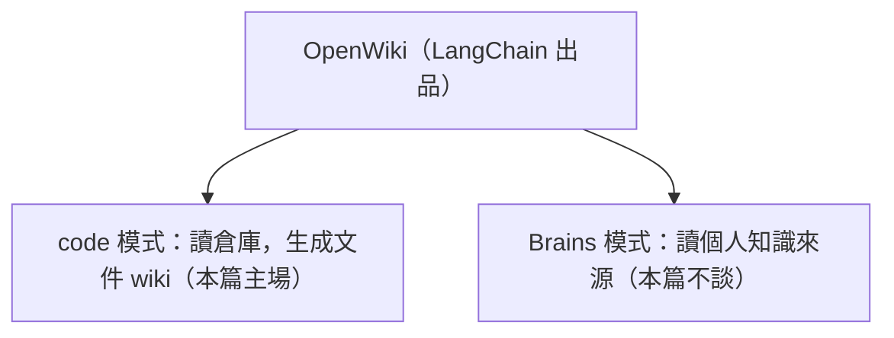

> 這是「AI 自維護的知識庫」系列的第 1 篇。本篇是拿我的部落格專案來實測，
> 用 [OpenWiki](https://github.com/langchain-ai/openwiki) 的 `code` 模式，處理一份
> 越長越難維護的 `AGENTS.md`。後續會有觀念篇（LLM Wiki 為什麼不是 RAG）與橋接篇（把
> codebase wiki 和個人知識庫接起來）。

別再把幾百頁倉庫說明塞進 AGENTS.md 了，而是生成一套 openwiki/，在 Agent 守則檔掛一句「讀XX wiki」。有需要的說明才會載入。Cursor、Claude Code、Codex 都能吃這套約定。

## 一份只增不減的守則檔

如果有用過 Claude Code 或 Codex 這類 coding agent，大概會知道 `CLAUDE.md` /
`AGENTS.md` 是什麼，這是一份放在倉庫裡、每次開對話就餵給 AI 的專案守則檔。有了它就能讓 AI 自動遵循專案規範來生成符合風格的程式碼。

`CLAUDE.md`和`AGENTS.md` 基本上功能是相同的，但`AGENTS.md`是現在coding agent的通用標準，而`CLAUDE.md`是 Claude Code 才會使用的標準，同時維護兩套守則實在很麻煩，因此我讓`CLAUDE.md` 變成一個轉接檔，在裡面添加一行`@AGENTS.md`，這樣 Claude Code 會把`AGENTS.md`載入進來。

最近我的部落格從 jekyll 遷移到了 Next.js，用 coding agent 開發時遇到的錯誤經驗、設計決策、功能簡介都會存到這個守則檔中，為了讓 AI 在每次除錯或
實作得到新教訓時都能紀錄下來，不讓問題在下一個對話輪迴。我在`AGENTS.md` 裡要求 AI 把踩到的坑寫回守則檔，讓知識沉澱
下來並遞迴式改進。代價是守則檔只增不減，太臃腫的守則檔反而會讓 AI 失焦，那麼有什麼方法能幫它瘦身呢？

LangChain 近期開源的 OpenWiki 使用 Andrej Karpathy 提出的 LLM Wiki 架構，讓四散的內容被整理為結構化、可互聯的 wiki 頁面。
OpenWiki 的 `code` 模式會讀你的倉庫，生成一座描述「這個專案怎麼運作」的 wiki 文件，並在守則檔中路由這些文件。


原來的守則檔長這樣：

```
AGENTS.md:295 行 / 21,375 字元
```

裡面什麼都有（以下這串名詞不需要看懂，只是想讓你感受它塞了多少種東西）：字型
subsetting 的完整 pipeline、Contentlayer 的 build 時序、service worker 怎麼產、mermaid 的
渲染架構、文章斷點的行寬數值、Git 工作流程、必過檢查、除錯守則。每一段都有用，但把它們
全部塞進每一次對話的開場是不可持續的。

## OpenWiki 是什麼

它是 LangChain 出的工具，你餵它一個資料來源，它就讓 LLM 自己生成、還定期維護一座人看得懂的 wiki。它有兩種模式：



- `code` 模式讀你的倉庫，生成一座描述「這個專案怎麼運作」的文件 wiki，還會在你的守則檔裡留一個指過去的入口（等一下就會看到）。這是本篇的主場。
- `Brains` 模式讀的是你的個人知識來源（Gmail、Notion、git、Hacker News 等），收斂成一座個人 wiki。

至於背後那套「讓 LLM 自己維護 wiki」的想法，還有它跟 RAG / GraphRAG 的區別，會留到系列第 2 篇討論。

## OpenWiki 拆的，跟我想拆的不是同一種東西

我一開始想得很單純：既然 OpenWiki 會生 wiki，那就讓它把肥大的 `AGENTS.md` 整個接手不就好了？

真的跑下去才發現不對。OpenWiki 生出來的是「描述性」的文件，會告訴你「這個專案的路由怎麼運作」「字型 pipeline 分成哪幾步」，講的都是程式碼**怎麼運作**。

但 `AGENTS.md` 裡大半是另一種東西：**命令句**。「不要直接 push main」「傳非 ASCII 給 CLI 一律走 `--text-file`」「必過檢查不能有條件跳過」，這些是規定 agent 該怎麼做、哪裡別踩雷。

差別出現在這裡。描述性文件會跟著程式碼變，交給 AI 自動維護剛剛好；命令句卻是我一次次踩坑換來的判斷，得一直擺在 AI 眼前，我還會不斷改它。要是把這些命令也交給一個會定期重寫的工具去管，等於讓機器蓋掉我累積的經驗，本末倒置。

所以該想清楚的是：這份大檔裡，哪些該搬去 wiki、哪些不應該動？

## 巨型守則檔的三個去處

我的答案是：先別急著決定「搬或不搬」。這份檔裡混了三種內容，各有各該去的地方。

| 內容類型 | 去處 | 為什麼 |
|---|---|---|
| **描述「怎麼運作」的機制**<br />字型 pipeline、build 時序、渲染架構 | `openwiki/` wiki | 會隨程式碼變動，交給 LLM 重生成 |
| **偶爾才用的長流程**<br />發圖、字型重建 | Skills | 按需載入，不佔每次開場 |
| **每次都得在場的命令句**<br />Git 流程、必過檢查、環境雷 | 留在 `AGENTS.md` | 需要常駐，又會被不斷改寫 |

會這樣分，是因為這三種內容「進到 AI 眼前」的方式根本不一樣：

- `AGENTS.md`（還有 `CLAUDE.md`）會整份注入上下文，內容太多除了浪費 token 以外，更重要的是可能讓 agent 不清楚重點在哪裡，降低工作能力。
- Skills 是按需載入的模組，你把一段內容獨立成一個 skill，它平常只露出一行簡介，agent 覺得這次用得到，才把整篇載進來。
- OpenWiki 的 wiki 有點類似 skill，不會直接注入上下文，當 agent 判斷需要哪塊知識時，才會順著 `AGENTS.md` 裡的連結去翻那一頁。

我讓描述機制進 wiki、命令句留在 `AGENTS.md`。

### 自己手寫的守則會不會被改？

把原來自己管裡的守則檔，交給一個「會自動改檔」的工具，最怕的就是：它哪天會不會把我寫的規則也蓋掉？答案是不會。OpenWiki 在 `AGENTS.md` 和 `CLAUDE.md` 裡，只維護一塊屬於它自己的標記區，長這樣：

```markdown
<!-- OPENWIKI:START -->

## OpenWiki

This repository uses OpenWiki for recurring code documentation. Start with
`openwiki/quickstart.md`, then follow its links to architecture, workflows...

<!-- OPENWIKI:END -->
```

第一次跑 `--init`（初始化那次的指令）時，它把這塊加進守則檔。之後每次 `--update`（後續更新用的指令），只重寫 `START` 和 `END` 中間那段，你手寫的部分一個字都不會動。也就是說，「LLM 自動維護的 wiki 入口」和「自己手寫、agent 自己記下的守則」可以住在同一個檔裡，各過各的。

## 實際跑一次 `openwiki --init`，它產出了什麼

理論講完了，來看真跑起來會發生什麼。我在倉庫根目錄執行 `openwiki --init`，它一共做了四件事：

1. 生出一座 `openwiki/` wiki（quickstart、架構總覽、runbook 等頁）。
2. 在 `AGENTS.md` 和 `CLAUDE.md` **兩個檔**各塞一塊 `OPENWIKI:START/END` 標記，就是上一節那塊。
3. 生出一支排程 GitHub Action `openwiki-update.yml`，想定期自動開 PR 更新 wiki。
4. 留下一個 `openwiki/INSTRUCTIONS.md`，一份要我自己填的「wiki 該涵蓋什麼」的說明。

### 守則檔的描述機制移到 wiki

`AGENTS.md` 原本有一整段在講字型 pipeline。看下面這段 diff 的時候，重點是它有多長，不是內容：

```diff
- - build 需要 HarfBuzz CLI。字型 subsetting 的 pipeline、哪些字進哪個 bucket、
-   產物要跟 manifest 一起 commit、CI 與本機的差異...（連續十餘行 repo 內部細節）
+ - **字型產物必須整組一起 commit,不要手改 generated 檔。**
+   pipeline 細節與所需 CLI 見 `openwiki/operations/runbook.md`。
```

拆完之後，`AGENTS.md` 只留下不會變的那句命令，外加一行指到 wiki 的連結：

這裡其實是兩件事：`AGENTS.md` 這十幾行被我壓成一行連結；而連過去那份完整的 `openwiki/operations/runbook.md`，是 OpenWiki 自己讀原始碼寫出來的，不是把這十幾行剪貼過去。`AGENTS.md` 只留「必須遵守的規則」，架構細節需要時再去 wiki 翻。

OpenWiki 生成的整座 wiki 長這樣：

```
openwiki/
|- quickstart.md                        67 行
|- INSTRUCTIONS.md                       14 行   ← 第 4 樣產物，唯一人手維護
|- architecture/overview.md             63 行
|- operations/runbook.md                86 行
|- workflows/content-and-publishing.md  70 行
\- testing/quality-contracts.md         75 行
                                        -----
                                        375 行（全部按需讀取，不進開場 context）
```

### CLAUDE.md 改用 symlink

前面 `--init` 時做的第 2 件事：它往 `AGENTS.md` 和 `CLAUDE.md` 兩個檔都塞了一塊 `OPENWIKI:START/END`。這在我的 repo 會出事，因為 `CLAUDE.md` 本來只是寫著一句 `@AGENTS.md` 的轉接檔。

OpenWiki 是把標記區塊當「純文字」硬寫進去的，它不管 `CLAUDE.md` 裡那句 `@AGENTS.md` 是什麼意思。於是 `--init` 跑完，`CLAUDE.md` 同時扛了兩份 OPENWIKI：一份是它自己被塞進去的，另一份是它 import 進來的 `AGENTS.md`（裡面也被塞了一塊）。結果 Claude Code 一載入 `CLAUDE.md`，就把同一段 OPENWIKI 的描述載入上下文兩次，雖然說 OpenWiki 是按需載入，但可能導致黑箱的行為是不能被允許的。

怎麼把 `CLAUDE.md` 留著，又不讓 Claude Code 讀到重複那段。做法是把它從轉接檔改成一條指向 `AGENTS.md` 的符號連結：

```diff
- CLAUDE.md（stub:一句 @AGENTS.md）
+ CLAUDE.md -> AGENTS.md（symlink）
```

這樣一來，`CLAUDE.md` 和 `AGENTS.md` 在檔案系統層面根本是同一個檔：只剩一塊 OPENWIKI，重複消失；OpenWiki 下次再往「兩個檔名」寫，也是寫到同一處，不會再分岔，但 windows 的 symlink 好像要額外設定，不過 wsl2 也很成熟了，就不要再用原生環境開發了吧。

### GitHub Actions 被我擋在版本庫外

`--init` 產的第 3 樣東西，是排程 workflow `openwiki-update.yml`，它想定期自動開 PR 幫你更新 wiki。但它有兩個問題：一是每次執行都無條件把這支檔覆寫掉（你改了也是白改）；二是它靠 GitHub Actions 開 PR，得在 github 中打開「Allow Actions to create and approve pull requests」，這是這個專案刻意不開的權限。

所以我乾脆把它擋在版本庫外：

```gitignore
# OpenWiki:生成的 workflow 每次 --init/--update 都被無條件覆寫(手改必被蓋),
# 且它用 Actions 開 PR,需要 repo 層「Allow Actions to create and approve pull
# requests」權限,本專案刻意不開。故本機任它重寫,但永不入庫。
/.github/workflows/openwiki-update.yml
```

本機隨它去重寫，但永遠不入庫。要更新 wiki，我自己在本機跑 `openwiki --update`，產物照樣走一般 PR 流程。也因為這樣，OpenWiki 不會在 CI 或 `main` 上自己動起來。

### 只少了 15 行，為什麼還是值得做

拆完後，回頭量一下每次開場會被塞進去的那份 `AGENTS.md`：

| 指標 | 導入前 | 導入後 | 變化 |
|---|---|---|---|
| `AGENTS.md`（每 session 開場注入） | 295 行 / 21,375 字元 | 280 行 / 19,841 字元 | −15 行 / −1,534 字元（字元 −7%） |
| `openwiki/`（改為按需讀取） | 0 | 375 行 | +375 |

第一眼看到 −15 行，我還愣了一下：一番折騰後，守則檔幾乎沒瘦多少？!

但這反而是對的。導入一個新工具，通常只會讓守則檔更肥，因為工具本身又帶來新的坑、新的規矩要記（前面那些關於 symlink、workflow、`INSTRUCTIONS.md` 的提醒，全是導入 OpenWiki 之後新寫進 `AGENTS.md` 的）。這次是一邊加這些新守則，一邊把描述機制的冗段壓成一行連結，一加一減打平，字元數最後還小掉了約 7%。

再把那 375 行的帳算清楚：`AGENTS.md` 統共才 295 行、也只掉了 15 行，怎麼可能吐得出 375 行。這是兩回事：我在守則檔裡做的，只是把不必全部載入的機制描述壓成一行連結，一加一減之後整份檔淨掉約 1,500 字元；那 375 行，是 OpenWiki 另外讀原始碼、自己寫出來的 wiki，比原來的描述更詳細，如果不做 wiki ， agent 要改功能時都要讀一次完整代碼才能了解機制，現在不用每次都浪費 token 看完，這樣看下來是很划算的！

## 如果你也想開始實作，有幾點需要注意

- **先確認標記塊和原本的守則共存**：`--init` 跑完第一件事，是去看 `AGENTS.md` 和 `CLAUDE.md`，確認原來你手寫的守則都原封不動，只多了 `OPENWIKI:START/END` 那塊，確認了再往下進行。
- **別讓自動更新去撞你的必過檢查和部署**：以我的 repo 為例，必過檢查有兩個（名字剛好叫 `ci`、`check`）。OpenWiki 那支自動 PR 的 workflow 不該被算進必過，也不該攪到正常部署，職責要分清楚。
- **搬東西要有邊界**：只把「描述怎麼運作」的段落丟進 wiki，約束 agent 的命令不應該搬走。如果這條守則是要常駐的，搬走後 agent 也未必會主動去 wiki 翻，那規則就相當於不存在。
- **`INSTRUCTIONS.md` 是唯一可以改的檔案**：前面說過，它是給 OpenWiki 的說明，界定 wiki 該涵蓋什麼、先後順序怎麼排，OpenWiki 只讀不覆寫。生成內容跑偏了，就在這裡加約束，而不是去改 `openwiki/` 底下那些生成頁（那些下次 `--update` 又會被重寫）。它是真的會跑偏：我實測時，它一度把「跑的當下有哪些檔還沒被 git 追蹤」寫成 repo 的永久事實，那明明只是一時狀態。

### OpenWiki 使用 Codex 額度

跑 OpenWiki 需要 LLM，預設是走 API，按 token 計費，生成和更新都要花錢。這樣 coding agent 訂閱是一份錢，文件生成又是一份錢，而且還要再管一套 Key 很麻煩。

如果你也有一樣的煩惱，可以設 `OPENWIKI_PROVIDER=openai-chatgpt`，改用「Sign in with ChatGPT」授權（會開瀏覽器到 auth.openai.com 登入，token 存在 `~/.openwiki/.env`）。

這樣跑 OpenWiki 就不會有 API 帳單，而是用 ChatGPT 帳號的 Codex 額度，跟 Codex CLI、Codex APP 是同一個額度池，所以不能把它當成無限量的 CI 後端在跑。

雖然會消耗 Codex 的額度，但實際上讀取文件也不會真的消耗很多額度，況且就算不用 OpenWiki 你大概還是要讓 AI 定期更新專案守則，那本來就會消耗額度所以也沒什麼影響了。不過如果你參與的是團隊協作的專案，需要用 OpenWiki 的 GitHub Actions，那麼就不適合用 OAuth 的方式。

## 該進 wiki、做成 skill，還是留在守則？

當你的 `CLAUDE.md` 或 `AGENTS.md` 開始發胖，可以用三個問題判斷：

- 這段內容每次對話都得在場，而且你和 agent 還會不斷改它嗎？留在 `AGENTS.md`。命令句、環境雷、Git 流程、必過檢查都算，硬把它們做成別的東西，就斷了它自我迭代的價值。
- 這段只有做某類任務才用得到，而且落落長嗎？做成 Skill，讓它平常只佔一行簡介，用到才把全文叫出來。
- 這段在講程式碼怎麼運作，而且會跟著程式碼變嗎？交給 OpenWiki 進 wiki，讓 LLM 定期重寫，守則檔只留一句連結指過去。

> 下一篇會再往上一層，聊聊觀念：同樣是 AI 知識庫，LLM Wiki 和 RAG 要怎麼選？「寫進去時就一次編譯好」跟「每次問了才臨時檢索、再拼答案」的差別，決定了應該用哪一種。

---

*本文提到的 OpenWiki 是 LangChain 的開源專案，工具更新很快，實際的指令和行為，還是以 [官方 repo](https://github.com/langchain-ai/openwiki) 當前的文件為準。*
