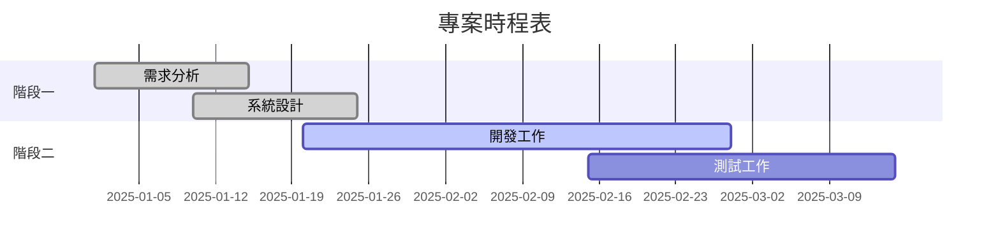

# Mermaid 圖表固有尺寸與渲染決定性 實作計畫

> ⚠️ **已執行完畢,且多處被審查推翻。本檔的程式碼片段不可複製使用。**
> 實作過程經過 6 輪外部審查,以下片段在合併前全部被換掉,因為它們各自帶著這個分支
> 最終消滅的假綠:Task 2 的 `parseSvgRootDimensions`(未錨定、屬性值可穿透、接受 `0x10`、
> 只檢查原始值 `> 0`)、Task 1 的 `startsWith('gantt')` + 單一 fixture + 精確字串
> `class="today"`、Task 4 的 `html.match(/]*>/g)` + 逐值 `toContain`。
> **現況以 `docs/superpowers/specs/2026-08-01-mermaid-image-dimensions-design.md` 的
> 「實作修正(審查後)」區塊與已合併的程式碼為準。**

> **For agentic workers:** REQUIRED SUB-SKILL: Use superpowers:subagent-driven-development (recommended) or superpowers:executing-plans to implement this plan task-by-task. Steps use checkbox (`- [ ]`) syntax for tracking.

**Goal:** 讓 mermaid 的 `` 在 SVG 抵達前就保留正確版位(消除 CLS),並讓 gantt 的渲染輸出不再依賴系統時鐘。

**Architecture:** 尺寸來源是已 commit 的 SVG 根標籤(`normalizeSvg` 早就寫進去了),**不新增 manifest**。producer(`mermaid-render.mjs` 寫檔前)與 consumer(`rehype-mermaid.mjs` 產生 ``)**共用同一個 `parseSvgRootDimensions`**,所以 producer 的驗證真正等於「consumer 讀得到」。gantt 用 mermaid 原生的 `todayMarker off` 指令關掉會過期的今日標記。

**Tech Stack:** Node ESM、unified/rehype(hast)、vitest、Playwright、mermaid 11.16

## Global Constraints

- **設計正文是 `docs/superpowers/specs/2026-08-01-mermaid-image-dimensions-design.md`。** 有衝突以 spec 為準。
- **不得修改 `scripts/mermaid-shared.mjs` 的 `normalizeSvg`、`CACHE_VERSION`、`LIGHT_THEME`、`DARK_THEME`。** 動到任一個都會讓 20 個 SVG 全量重生,超出本次範圍。
- **不得新增 manifest 存尺寸。** `openwiki/INSTRUCTIONS.md` 明文禁止。
- **不得改 `css/tailwind.css` 的 `.mermaid-figure` 規則。** 設計已判定 CSS 不需改,由 Task 5 實測確認。
- **每條新斷言都要做突變測試**:刻意把它宣稱要防的東西弄壞,確認它真的變紅。抓不到就是空包彈,必須重寫。
- **commit 一律用明確檔案清單 `git add <path>...`**,絕不 `git add -A` —— `next-env.d.ts` 會反覆翻動且必須排除。
- 指令:`yarn test:unit`(vitest)、`yarn test:parity`(Playwright)、`yarn mermaid:render`、`node ./scripts/mermaid-render.mjs --check`。

---

### Task 1: gantt 關閉 today marker

**Files:**
- Modify: `data/blog/hidden/2025-08-29-mermaid-v10-test.md:48-58`
- Modify: `public/mermaid/` (由 `yarn mermaid:render` 產生,2 增 2 刪)
- Test: `tests/unit/mermaid-gantt-contract.test.ts`(新建)

**Interfaces:**
- Consumes: `extractMermaidDefinitions`、`hashDiagram`、`svgFileName`、`PUBLIC_MERMAID_DIR`(皆已存在於 `scripts/mermaid-shared.mjs`)
- Produces: 無(其他 task 不依賴此 task)

- [ ] **Step 1: 寫失敗的測試**

建立 `tests/unit/mermaid-gantt-contract.test.ts`:

```ts
import { describe, expect, it } from 'vitest'
import { promises as fs } from 'node:fs'
import path from 'node:path'
import {
  extractMermaidDefinitions,
  hashDiagram,
  svgFileName,
  PUBLIC_MERMAID_DIR,
} from '../../scripts/mermaid-shared.mjs'

const FIXTURE = path.join(process.cwd(), 'data/blog/hidden/2025-08-29-mermaid-v10-test.md')

async function ganttDefinition(): Promise<string> {
  const markdown = await fs.readFile(FIXTURE, 'utf8')
  const gantt = extractMermaidDefinitions(markdown).filter((def) =>
    def.trimStart().startsWith('gantt')
  )
  expect(gantt).toHaveLength(1)
  return gantt[0]
}

describe('gantt today marker', () => {
  // build 時渲染的 gantt 會把「今天」凍結在渲染那一刻:日期範圍涵蓋今天的圖,
  // committed SVG 會從隔天起對讀者說謊。mermaid-check 刻意不比對 SVG 內容,抓不到。
  it('定義明確關閉 today marker', async () => {
    expect(await ganttDefinition()).toMatch(/^\s*todayMarker\s+off\s*$/m)
  })

  // 這條同時抓「directive 還在但忘了重新 render」—— 那時 hash 已變,
  // 讀不到對應檔案會直接 ENOENT 失敗。
  it('committed 的兩份 SVG 都不含 today 元素', async () => {
    const hash = hashDiagram(await ganttDefinition())
    for (const variant of ['light', 'dark'] as const) {
      const file = path.join(PUBLIC_MERMAID_DIR, svgFileName(hash, variant))
      const svg = await fs.readFile(file, 'utf8')
      expect(svg, `${variant} 變體仍含 today marker`).not.toContain('class="today"')
    }
  })
})
```

> 斷言用 `class="today"` 而非 `today`:SVG 內嵌樣式表有 `#mmd-… .today{fill:none;stroke:red}`,
> 它**不含**字串 `class="today"`,所以不會誤報。

- [ ] **Step 2: 跑測試,確認它失敗**

Run: `yarn test:unit tests/unit/mermaid-gantt-contract.test.ts`
Expected: FAIL。第一條因為定義裡沒有 `todayMarker off`;第二條因為現有 SVG 含
`<g class="today">`。

- [ ] **Step 3: 加上 directive**

在 `data/blog/hidden/2025-08-29-mermaid-v10-test.md` 的 gantt 區塊,`dateFormat` 那行**之後**插入一行:

```
    todayMarker off
```

改完該區塊應為:

````

````

> `todayMarker off` 全是 ASCII,不會新增任何中文 code point,所以**不影響 Chiron 字型預算**
> (`check:site-font` 讀整份 markdown 且不剝 code fence,但只算非 ASCII 字元的分桶)。

- [ ] **Step 4: 重新渲染**

Run: `yarn mermaid:render`
Expected: `mermaid 已寫入 20 個 SVG`。定義改了 → hash 改了 → 舊的
`bb0c54277d466f73.{light,dark}.svg` 成為孤兒被清掉,新 hash 的兩個檔案產生。

- [ ] **Step 5: 跑測試,確認通過**

Run: `yarn test:unit tests/unit/mermaid-gantt-contract.test.ts`
Expected: PASS(2 passed)

- [ ] **Step 6: 確認結構檢查一致**

Run: `node ./scripts/mermaid-render.mjs --check`
Expected: `mermaid 快取結構一致(10 張圖 → 20 個 SVG)`

- [ ] **Step 7: 突變測試**

暫時把 `todayMarker off` 那行刪掉,跑 `yarn test:unit tests/unit/mermaid-gantt-contract.test.ts`。
Expected: 第一條 FAIL。確認後把該行**加回來**。

- [ ] **Step 8: 確認 diff 只有預期的 4 個檔案異動**

Run: `git status --short public/mermaid/`
Expected: 2 個 `D`(舊 hash)、2 個 `??`(新 hash),其餘 16 個檔案不出現。
若其他檔案也變了,**不要 commit**,先確認是不是平台字型量測差異造成的(見 spec §4 的警告)。

- [ ] **Step 9: Commit**

```bash
git add data/blog/hidden/2025-08-29-mermaid-v10-test.md tests/unit/mermaid-gantt-contract.test.ts public/mermaid/
git commit -m "fix: stop the gantt today marker from freezing a stale date

A build-time-rendered gantt bakes \"today\" into the committed SVG, so any
diagram whose range covers the current date starts lying to readers the
next day. It also rewrote the SVG whenever mermaid:render ran on a later
date -- same-day reruns are byte-identical because Math.random is already
stubbed with a fixed-seed LCG -- producing
diff churn. mermaid-check compares filenames only and never reads SVG
content, so neither symptom had any automated defence.

todayMarker off is mermaid's own directive and lives at the semantic
source, so the diagram hash invalidates naturally -- no CACHE_VERSION
bump and no pipeline code. The regression test pins both the directive
and the absence of the rendered element, so deleting the directive fails
whether or not the artifacts are regenerated.

Co-Authored-By: Claude Opus 5 <noreply@anthropic.com>"
```

---

### Task 2: 共用的根標籤尺寸解析器

**Files:**
- Modify: `scripts/mermaid-shared.mjs`(新增匯出,**不動** `normalizeSvg`/`CACHE_VERSION`/主題)
- Test: `tests/unit/mermaid-shared.test.ts`

**Interfaces:**
- Consumes: 無
- Produces: `parseSvgRootDimensions(svg: string) => { width: number, height: number } | null`
  —— Task 3(producer)與 Task 4(consumer)都要用這一個。

- [ ] **Step 1: 寫失敗的測試**

在 `tests/unit/mermaid-shared.test.ts` 的 import 清單加入 `parseSvgRootDimensions`,並在檔案
末端追加:

```ts
describe('parseSvgRootDimensions', () => {
  // producer 與 consumer 共用同一個實作是刻意的:兩邊各一套 parser 會出現
  // 「producer 過關、consumer 仍解析失敗」的縫隙,producer 的保證就是假的。
  it('抽出小數尺寸(mermaid 的 viewBox 幾乎都是小數,10 組有 7 組)', () => {
    const svg =
      '<svg height="461.63739013671875" width="722.8872680664062" viewBox="0 0 722.8872680664062 461.63739013671875"></svg>'
    expect(parseSvgRootDimensions(svg)).toEqual({
      width: 722.8872680664062,
      height: 461.63739013671875,
    })
  })

  it('屬性順序與夾雜的其他屬性不影響抽取', () => {
    const svg = '<svg id="mmd-abc-dark" class="classDiagram" width="650" role="img" height="355">'
    expect(parseSvgRootDimensions(svg)).toEqual({ width: 650, height: 355 })
  })

  it('缺 width 或缺 height 回傳 null', () => {
    expect(parseSvgRootDimensions('<svg height="10"></svg>')).toBeNull()
    expect(parseSvgRootDimensions('<svg width="10"></svg>')).toBeNull()
  })

  it('非數字(例如未被清掉的 width="100%")回傳 null', () => {
    expect(parseSvgRootDimensions('<svg width="100%" height="10"></svg>')).toBeNull()
  })

  it('零或負值回傳 null —— 零尺寸保留不了版位,與缺尺寸同樣有害', () => {
    expect(parseSvgRootDimensions('<svg width="0" height="10"></svg>')).toBeNull()
    expect(parseSvgRootDimensions('<svg width="10" height="-5"></svg>')).toBeNull()
  })

  it('沒有 svg 根標籤回傳 null', () => {
    expect(parseSvgRootDimensions('<html><body>nope</body></html>')).toBeNull()
  })
})
```

- [ ] **Step 2: 跑測試,確認它失敗**

Run: `yarn test:unit tests/unit/mermaid-shared.test.ts`
Expected: FAIL,`parseSvgRootDimensions is not a function`(或 import 解析錯誤)。

- [ ] **Step 3: 實作**

在 `scripts/mermaid-shared.mjs` 的 `normalizeSvg` **之後**加入:

```js
/**
 * 從 SVG 字串的根標籤抽出固有尺寸。回傳 null 代表根標籤缺尺寸、非數字、或不是有限正數。
 *
 * **producer 與 consumer 共用同一個實作是刻意的。** producer(mermaid-render 寫檔前)
 * 若用瀏覽器的 DOMParser、consumer(rehype,在 Node 裡)用字串解析,兩者的接受集合不同,
 * 就會出現「producer 驗證過關、consumer 仍解析失敗」的縫隙 —— producer 的不變量因此
 * 只是「某個 parser 讀得到」,而不是我們真正要的「consumer 讀得到」。
 */
export function parseSvgRootDimensions(svg) {
  const root = svg.match(/<svg\b[^>]*>/i)
  if (!root) return null
  const width = Number(root[0].match(/\swidth="([^"]*)"/i)?.[1])
  const height = Number(root[0].match(/\sheight="([^"]*)"/i)?.[1])
  if (!Number.isFinite(width) || !Number.isFinite(height)) return null
  if (width <= 0 || height <= 0) return null
  return { width, height }
}
```

- [ ] **Step 4: 跑測試,確認通過**

Run: `yarn test:unit tests/unit/mermaid-shared.test.ts`
Expected: PASS(全部通過,含既有的 `normalizeSvg` 等測試)

- [ ] **Step 5: 突變測試**

把 `if (width <= 0 || height <= 0) return null` 暫時刪掉,重跑。
Expected: 「零或負值回傳 null」FAIL。確認後**加回來**。

- [ ] **Step 6: Commit**

```bash
git add scripts/mermaid-shared.mjs tests/unit/mermaid-shared.test.ts
git commit -m "feat: share one SVG root dimension parser across the pipeline

The renderer and the rehype plugin both need the intrinsic size of a
committed SVG, and they must agree on what counts as parseable. Giving
the producer a browser DOMParser and the consumer a string parser would
leave a gap where render-time validation passes but the consumer still
fails, making the producer's guarantee meaningless.

Returns null rather than throwing so each caller can attach its own
context -- the renderer knows the diagram id, the plugin knows the path.

Co-Authored-By: Claude Opus 5 <noreply@anthropic.com>"
```

---

### Task 3: producer 端不變量

**Files:**
- Modify: `scripts/mermaid-render.mjs:6-15`(import)、`:72-87`(`renderVariant` 尾段)

**Interfaces:**
- Consumes: `parseSvgRootDimensions`(Task 2)
- Produces: 不變量「任何寫進 `public/mermaid/` 的 SVG 都有合法正尺寸」,Task 4 依賴它

- [ ] **Step 1: 加入 import**

在 `scripts/mermaid-render.mjs` 的 `mermaid-shared.mjs` import 區塊加入 `parseSvgRootDimensions`:

```js
import {
  extractMermaidDefinitions,
  markdownFiles,
  hashDiagram,
  svgFileName,
  normalizeSvg,
  parseSvgRootDimensions,
  LIGHT_THEME,
  DARK_THEME,
  PUBLIC_MERMAID_DIR,
} from './mermaid-shared.mjs'
```

- [ ] **Step 2: 在既有的 DOMParser 關卡之後加驗證**

`renderVariant` 目前在 `if (parseError) { throw … }` 之後直接 `return normalized`。
在 `return normalized` **之前**插入:

```js
  // 既有的 DOMParser 只檢查 XML 合法性 —— 合法但沒有尺寸的 SVG 照樣會寫進快取,
  // 而 mermaid-check 只比對檔名、不讀內容,consumer 端就只能在 build 時才發現。
  // 在生產端把不變量守住:寫出去的每一份 SVG 都要能被 consumer 讀到正尺寸。
  if (!parseSvgRootDimensions(normalized)) {
    throw new Error(
      `${id} 產出的 SVG 根標籤沒有合法的 width/height, 無法取得固有尺寸、` +
        `版位不會被保留。多半是 normalizeSvg 的 viewBox 正規式沒有匹配到這個圖種的輸出。`
    )
  }
  return normalized
```

- [ ] **Step 3: 跑完整渲染,確認 20 個現有 SVG 都通過不變量**

Run: `yarn mermaid:render`
Expected: `mermaid 已寫入 20 個 SVG`,無錯誤。這同時證明不變量對現有全部圖種都成立。

- [ ] **Step 4: 確認沒有產生非預期的檔案異動**

Run: `git status --short public/mermaid/`
Expected: 空(Task 1 的變更已 commit,這次重渲染應逐位元組相同)。
若有異動,先確認是不是平台差異,不要盲目 commit。

- [ ] **Step 5: 突變測試**

暫時把 `renderVariant` 的驗證改成對第一張圖強制失敗(例如在 `if (!parse…)` 上方插入
`if (id.endsWith('-light')) throw new Error('mutation')`),跑 `yarn mermaid:render`。
Expected: 整個 render 失敗且**沒有寫入任何檔案**(`writeAll` 只在全量成功後才跑)。
確認後把突變移除,重跑 `yarn mermaid:render` 確認恢復正常。

- [ ] **Step 6: Commit**

```bash
git add scripts/mermaid-render.mjs
git commit -m "feat: reject renders whose SVG root has no usable dimensions

The existing DOMParser gate only proves the output is well-formed XML. A
legal SVG with no width/height still gets written, mermaid-check compares
filenames and never reads content, and the defect only surfaces as a
missing intrinsic size in the browser -- the same silent shape that let a
bare <br> reach production.

Validating with the parser the consumer actually uses makes this a real
guarantee rather than a second opinion. Verified against all 20 committed
artifacts.

Co-Authored-By: Claude Opus 5 <noreply@anthropic.com>"
```

---

### Task 4: consumer 端尺寸抽取

**Files:**
- Modify: `lib/rehype-mermaid.mjs`(全檔)
- Test: `tests/unit/rehype-mermaid.test.ts`(fixture 遷移 + 新斷言)

**Interfaces:**
- Consumes: `parseSvgRootDimensions`(Task 2)、Task 3 的不變量
- Produces: `` 帶整數 `width`/`height` 屬性,Task 5 的 Playwright 測試依賴它

- [ ] **Step 1: 先遷移既有 fixture(否則新行為會讓既有測試壞掉)**

現有 fixture 是 `'<svg/>'`,不含尺寸,改成 fail-loud 後既有的「快取命中」測試會丟錯。
在 `tests/unit/rehype-mermaid.test.ts` 的 `DEF` 宣告之後加入 helper,並改掉三處寫檔:

```ts
// light 與 dark 刻意用**不同**的兩軸數值:現有 10 組 committed SVG 的 light/dark 尺寸
// 剛好相同,所以「讀 light 套給 dark」的實作在 Playwright 層測不出來,只能在這裡守。
function svgFixture(width: number, height: number) {
  return `<svg width="${width}" height="${height}" viewBox="0 0 ${width} ${height}"></svg>`
}
const LIGHT = { width: 261.5546875, height: 522 }
const DARK = { width: 263.25, height: 524.75 }
```

`beforeAll` 內的兩行改為:

```ts
  await fs.writeFile(
    path.join(cacheDir, svgFileName(hash, 'light')),
    svgFixture(LIGHT.width, LIGHT.height)
  )
  await fs.writeFile(
    path.join(cacheDir, svgFileName(hash, 'dark')),
    svgFixture(DARK.width, DARK.height)
  )
```

第一個測試(巢狀 span)內的兩行同樣改為 `svgFixture(LIGHT.width, LIGHT.height)` 與
`svgFixture(DARK.width, DARK.height)`。

- [ ] **Step 2: 寫失敗的測試**

在 `describe('rehypeMermaid', …)` 內追加兩個測試:

```ts
  it('img 帶整數 width/height,且 light/dark 各自使用自己的尺寸', () => {
    const html = render('```mermaid\n' + DEF + '\n```\n', cacheDir)

    // 不能用 toContain 逐值比對:那只證明「這些數字出現過」,無法證明哪個值落在哪個
    // 元素上 —— 把 light 的尺寸寫到 dark 上,逐值比對照樣全綠。要守位置就得把
    // 每個  標籤整段抓出來各自檢查。
    const tags = html.match(/]*>/g) ?? []
    expect(tags).toHaveLength(2)
    const light = tags.find((tag) => tag.includes('mermaid-light'))
    const dark = tags.find((tag) => tag.includes('mermaid-dark'))
    expect(light).toBeDefined()
    expect(dark).toBeDefined()

    // Math.round(261.5546875) === 262(截斷會得到 261,故此值能抓到漏 round)
    expect(light).toContain('width="262"')
    expect(light).toContain('height="522"')
    expect(dark).toContain('width="263"')
    expect(dark).toContain('height="525"')
  })

  it('快取檔案存在但根標籤沒有合法尺寸時丟錯並指出路徑(不得靜默退化)', async () => {
    // mermaid-check 只比對檔名,對「檔案在、尺寸缺」這種狀態是綠的 —— 靜默退化
    // 等於新增一條 render/check/build 全綠卻在 production 退化的路徑。
    const brokenDef = 'graph TD\n  P-->Q'
    const hash = hashDiagram(brokenDef)
    await fs.writeFile(path.join(cacheDir, svgFileName(hash, 'light')), '<svg></svg>')
    await fs.writeFile(path.join(cacheDir, svgFileName(hash, 'dark')), '<svg></svg>')

    expect(() => render('```mermaid\n' + brokenDef + '\n```\n', cacheDir)).toThrow(
      new RegExp(svgFileName(hash, 'light'))
    )
  })
```

- [ ] **Step 3: 跑測試,確認它失敗**

Run: `yarn test:unit tests/unit/rehype-mermaid.test.ts`
Expected: FAIL。第一條因為 img 還沒有 width/height 屬性;第二條因為目前不丟錯。

- [ ] **Step 4: 實作**

改寫 `lib/rehype-mermaid.mjs`。import 區塊加入 `parseSvgRootDimensions`:

```js
import {
  hashDiagram,
  svgFileName,
  parseSvgRootDimensions,
  PUBLIC_MERMAID_DIR,
  MERMAID_URL_BASE,
} from '../scripts/mermaid-shared.mjs'
```

`imgNode` 改為接受尺寸:

```js
function imgNode(className, src, dimensions) {
  return {
    type: 'element',
    tagName: 'img',
    properties: {
      className: [className],
      src,
      alt: 'Mermaid diagram',
      loading: 'lazy',
      // HTML 的 width/height 內容屬性是**非負整數**,而 mermaid 的 viewBox 幾乎都是小數
      // (現有 10 組有 7 組至少一軸是小數)。與其依賴各瀏覽器對非法值的容錯行為,主動取整。
      // 代價是載入前後最多約 0.889px 的次像素更新 —— 遠小於原本完全不保留版位的位移。
      width: Math.round(dimensions.width),
      height: Math.round(dimensions.height),
    },
    children: [],
  }
}
```

在 `imgNode` 之後加入讀檔函式:

```js
/**
 * 讀快取 SVG 的固有尺寸。
 *
 * 回傳 null 只有一種意思:**檔案不存在**(快取未命中)—— 呼叫端退化成程式碼區塊,
 * 這條路徑由 `mermaid-check` 的缺檔回報兜底。
 *
 * 檔案存在卻讀不到合法尺寸則**丟錯**:`mermaid-check` 完全不會回報這種狀態
 * (它只比對檔名、不讀內容),靜默退化等於新增一條沒有任何防線的失敗路徑。
 */
function readSvgDimensions(filePath) {
  let svg
  try {
    svg = fs.readFileSync(filePath, 'utf8')
  } catch (error) {
    if (error.code === 'ENOENT') return null
    throw error
  }
  const dimensions = parseSvgRootDimensions(svg)
  if (!dimensions) {
    throw new Error(
      `${filePath}: mermaid 快取的 SVG 根標籤沒有合法的 width/height。` +
        '請重跑 `yarn mermaid:render` 後 commit。'
    )
  }
  return dimensions
}
```

visitor 內的快取檢查改為:

```js
      const hash = hashDiagram(codeText(code))
      const lightFile = svgFileName(hash, 'light')
      const darkFile = svgFileName(hash, 'dark')
      // 快取未命中:保留原節點,退化為程式碼區塊
      const lightDimensions = readSvgDimensions(path.join(cacheDir, lightFile))
      if (!lightDimensions) return
      const darkDimensions = readSvgDimensions(path.join(cacheDir, darkFile))
      if (!darkDimensions) return

      parent.children[index] = {
        type: 'element',
        tagName: 'figure',
        properties: { className: ['mermaid-figure', 'overflow-x-auto'] },
        children: [
          imgNode('mermaid-light', `${urlBase}/${lightFile}`, lightDimensions),
          imgNode('mermaid-dark', `${urlBase}/${darkFile}`, darkDimensions),
        ],
      }
```

移除原本的 `fs.existsSync` 區塊(已被 `readSvgDimensions` 取代)。

- [ ] **Step 5: 跑測試,確認通過**

Run: `yarn test:unit tests/unit/rehype-mermaid.test.ts`
Expected: PASS(6 passed —— 4 個既有 + 2 個新增)

- [ ] **Step 6: 突變測試(兩個)**

**突變 A:** 把 `imgNode` 的 `Math.round(dimensions.width)` 改成 `dimensions.width`。
Run: `yarn test:unit tests/unit/rehype-mermaid.test.ts`
Expected: 「img 帶整數 width/height」FAIL(得到 `width="261.5546875"`)。復原。

**突變 B:** 把 `imgNode('mermaid-dark', …, darkDimensions)` 改成傳 `lightDimensions`。
Expected: 同一條 FAIL(dark 拿到 `width="262"` 而非 `263`)。復原。

- [ ] **Step 7: 跑完整單元測試組,確認沒有波及其他測試**

Run: `yarn test:unit`
Expected: 全數 PASS

- [ ] **Step 8: Commit**

```bash
git add lib/rehype-mermaid.mjs tests/unit/rehype-mermaid.test.ts
git commit -m "fix: give Mermaid images intrinsic dimensions before the SVG loads

The emitted  carried only class/src/alt/loading while the CSS sets
max-width:none and height:auto with no width, so nothing reserved a box
until the SVG arrived. The dimensions already existed on every committed
root element -- they simply never reached the markup.

HTML width/height are non-negative integers and 7 of the 10 artifacts
have a fractional axis, so both are rounded rather than relying on how
each browser tolerates an invalid value.

A missing file still degrades to a code block: mermaid-check reports that
case. A file that exists without usable dimensions now throws, because
mermaid-check compares filenames only and would never report it.

The unit fixtures now give light and dark different dimensions on both
axes -- all 10 committed pairs happen to match, so nothing else would
catch an implementation that read light and applied it to both.

Co-Authored-By: Claude Opus 5 <noreply@anthropic.com>"
```

---

### Task 5: Playwright 版位保留契約

**Files:**
- Modify: `tests/playwright/mermaid.spec.ts`(追加一個測試 + 兩個 helper)

**Interfaces:**
- Consumes: Task 4 產生的 `width`/`height` 屬性
- Produces: 無

**背景(實作者必讀):** 這個測試看起來比一般測試複雜,原因是三組斷言**各守不同鏈結,缺一不可**——
幾何組守「版位有沒有被保留」、natural-size 組守「保留的版位是不是對的絕對尺寸」、viewBox 組守
「產物自己的尺寸契約」。spec 的突變矩陣列了每一組獨有的、其他組抓不到的突變。

- [ ] **Step 1: 寫失敗的測試**

在 `tests/playwright/mermaid.spec.ts` 頂端把 import 改為:

```ts
import { expect, test, type Locator, type Page } from '@playwright/test'
```

在檔案末端追加:

```ts
async function settle(page: Page) {
  await page.evaluate(
    () =>
      new Promise<void>((resolve) =>
        requestAnimationFrame(() => requestAnimationFrame(() => resolve()))
      )
  )
}

async function measure(image: Locator) {
  return image.evaluate((node) => {
    const img = node as HTMLImageElement
    const rect = img.getBoundingClientRect()
    const sentinel = document.querySelector('[data-mermaid-sentinel]') as HTMLElement
    return {
      naturalWidth: img.naturalWidth,
      naturalHeight: img.naturalHeight,
      widthAttribute: img.getAttribute('width'),
      heightAttribute: img.getAttribute('height'),
      rect: { width: rect.width, height: rect.height },
      // 加上 scrollY 換算成文件絕對座標:版位變動可能連帶改變捲動位置,
      // 只用 viewport 相對座標會把兩種效應混在一起。
      sentinelTop: sentinel.getBoundingClientRect().top + window.scrollY,
    }
  })
}

test('SVG 抵達前就保留正確版位', async ({ browser, baseURL }) => {
  // 站台的 service worker 對 .svg 掛 StaleWhileRevalidate,而 Playwright 預設
  // serviceWorkers: 'allow' —— 不 block 的話量到的是 SW 快取行為而不是 markup,
  // 且 SW claim client 與首次影像請求是競態,會得到時好時壞的結果。
  const context = await browser.newContext({ baseURL, serviceWorkers: 'block' })
  try {
    let release!: () => void
    const responseGate = new Promise<void>((resolve) => {
      release = resolve
    })
    let seen!: () => void
    const requestSeen = new Promise<void>((resolve) => {
      seen = resolve
    })

    await context.route('**/mermaid/*.svg', async (route) => {
      seen()
      await responseGate
      await route.continue()
    })

    const page = await context.newPage()
    await page.goto(mermaidPath, { waitUntil: 'domcontentloaded' })

    const figure = page.locator('.mermaid-figure').first()

    // 不能用 :visible 選變體 —— Playwright 的可見性要求寬高皆 > 0,零高度元素
    // 會讓 locator 直接找不到,把「版位退化成零」偽裝成「元素不存在」。
    const shownIndex = await figure
      .locator('img')
      .evaluateAll((nodes) => nodes.findIndex((n) => getComputedStyle(n).display !== 'none'))
    expect(shownIndex).toBeGreaterThanOrEqual(0)
    const image = figure.locator('img').nth(shownIndex)

    // 保留 production 的 lazy 行為,不改成 eager。
    expect(await image.getAttribute('loading')).toBe('lazy')

    await figure.evaluate((node) => {
      // 捲動目標必須是獨立的 1×1 元素,不能是圖片本身 —— 否則「移除 height 屬性」
      // 的突變會讓 lazy 觸發失效,測試變成因為別的原因紅。
      const scrollTarget = document.createElement('span')
      scrollTarget.style.cssText = 'display:block;width:1px;height:1px'
      node.prepend(scrollTarget)
      const downstream = document.createElement('div')
      downstream.dataset.mermaidSentinel = ''
      node.after(downstream)
      scrollTarget.scrollIntoView({ behavior: 'instant', block: 'center' })
    })

    await requestSeen
    await settle(page)
    const before = await measure(image)

    // 正控制:證明閘門真的擋著。少了這條,before 量到的其實是 after,
    // 整組斷言會無聲空轉通過。
    expect(before.naturalWidth).toBe(0)
    expect(before.naturalHeight).toBe(0)

    // A 組:版位有沒有被保留
    expect(before.widthAttribute).not.toBeNull()
    expect(before.heightAttribute).not.toBeNull()
    expect(before.rect.height).toBeGreaterThan(0)
    expect(before.rect.height).toBeCloseTo(
      before.rect.width * (Number(before.heightAttribute) / Number(before.widthAttribute)),
      1
    )

    release()
    await image.evaluate((node) => (node as HTMLImageElement).decode())
    await settle(page)
    const after = await measure(image)

    // 容差 2px:整數屬性對小數固有尺寸,載入後改用真實比例必然有次像素更新
    //(實測 0.7068px,20 個產物最壞 0.8887px)。1px 只剩 0.11px 餘裕。
    expect(Math.abs(after.rect.height - before.rect.height)).toBeLessThan(2)
    expect(Math.abs(after.sentinelTop - before.sentinelTop)).toBeLessThan(2)

    // B 組:保留的版位是不是對的絕對尺寸。單獨守不住 height="1"(A 組負責),
    // 但 A 組守不住 width/height 同時 ×2 —— 那會比例自洽、前後一致,圖卻被放大兩倍。
    expect(after.naturalWidth).toBeGreaterThan(0)
    expect(Math.abs(after.naturalWidth - Number(before.widthAttribute))).toBeLessThanOrEqual(1)
    expect(Math.abs(after.naturalHeight - Number(before.heightAttribute))).toBeLessThanOrEqual(1)

    // C 組:產物自己的尺寸契約。B 組守不住「normalizeSvg 把 root 寫成 2W×2H」——
    // 那時 naturalWidth 也是 2W,與屬性一致。這裡錨到 viewBox 才切得開。
    // 注意這不是 SVG 的普遍規則(root viewport 與 viewBox 允許不同尺度),
    // 守的是 normalizeSvg 明確選定的契約:root 尺寸 = viewBox extent。
    const resource = await image.evaluate(async (node) => {
      const text = await fetch((node as HTMLImageElement).currentSrc).then((r) => r.text())
      const root = new DOMParser().parseFromString(text, 'image/svg+xml')
        .documentElement as unknown as SVGSVGElement
      return {
        rootWidth: root.width.baseVal.value,
        rootHeight: root.height.baseVal.value,
        viewBoxWidth: root.viewBox.baseVal.width,
        viewBoxHeight: root.viewBox.baseVal.height,
      }
    })
    expect(resource.rootWidth).toBeCloseTo(resource.viewBoxWidth, 6)
    expect(resource.rootHeight).toBeCloseTo(resource.viewBoxHeight, 6)
    expect(Number(before.widthAttribute)).toBe(Math.round(resource.viewBoxWidth))
    expect(Number(before.heightAttribute)).toBe(Math.round(resource.viewBoxHeight))
  } finally {
    await context.close()
  }
})
```

- [ ] **Step 2: 確認 port 3012 淨空,再跑測試確認它失敗**

`playwright.config.ts` 用 `reuseExistingServer: !CI`,殘留的 `yarn serve` 會讓測試沿用舊 build。

Run: `lsof -ti tcp:3012 || echo "port 淨空"`
若有殘留程序先關掉。

Run: `yarn test:parity tests/playwright/mermaid.spec.ts -g "保留正確版位"`
Expected: 在 Task 4 已完成的前提下應 PASS。若尚未跑 Task 4,則 A 組的
`before.widthAttribute` 會是 null 而 FAIL。

- [ ] **Step 3: 突變測試(四個,對應四條不同鏈結)**

每個突變改完就跑
`yarn test:parity tests/playwright/mermaid.spec.ts -g "保留正確版位"`,確認變紅後復原。

| 突變 | 改哪裡 | 預期哪一組紅 |
| --- | --- | --- |
| 移除 `height` 屬性 | `lib/rehype-mermaid.mjs` 的 `imgNode` 刪掉 `height` | A 組(`heightAttribute` 非 null) |
| `height` 寫死 `1` | `imgNode` 的 `height: 1` | A 組(`after` 與 `before` 的 `rect.height` 差距 ≫ 1) |
| 兩軸同時 ×2 | `imgNode` 兩個值都 `* 2` | **B 組**(A 組會全綠) |
| 拿掉 `serviceWorkers: 'block'` | 測試自身 | 不保證每次紅,但應觀察到不穩定/正控制失敗 —— 這條是說明用,觀察後復原即可 |

> 若「兩軸同時 ×2」沒有讓 B 組變紅,代表 B 組寫錯了,**必須重寫**才能繼續。

- [ ] **Step 4: 跑整份 mermaid spec,確認既有測試沒被波及**

Run: `yarn test:parity tests/playwright/mermaid.spec.ts`
Expected: 全數 PASS(既有 4 個 + 新增 1 個)

- [ ] **Step 5: 順帶記錄隱藏變體的載入時機**

在測試通過後,手動於同一份 production build 觀察:切換主題時原本隱藏的變體是否才開始下載。
把觀察結果(有/沒有延遲、延遲多久)記在 commit message —— spec §「明確排除」說明這是
**取得事實**,不在本 PR 修。

- [ ] **Step 6: Commit**

```bash
git add tests/playwright/mermaid.spec.ts
git commit -m "test: pin the Mermaid layout-reservation contract

Three assertion groups, each anchoring a link the others cannot:
geometry proves a box is reserved before the resource arrives,
natural-size proves the reserved box matches the decoded image, and
viewBox proves the artifact's own root-equals-viewBox contract holds.
Scaling width and height together passes geometry; height=\"1\" passes
natural-size; only the full set survives every mutation.

A naturalWidth === 0 positive control proves the response gate actually
held -- without it a route that failed to intercept would make the
before-load measurements silently become after-load ones and the whole
test would pass vacuously.

The context blocks service workers because the site StaleWhileRevalidates
.svg and Playwright defaults to allowing them, which would measure the
cache rather than the markup. Lazy loading is preserved and triggered via
a standalone 1x1 scroll target, so removing the height attribute cannot
break the trigger and turn a real failure into an unrelated one.

Co-Authored-By: Claude Opus 5 <noreply@anthropic.com>"
```

---

### Task 6: 文件連動與 OpenWiki

**Files:**
- Modify: `openwiki/operations/runbook.md`(mermaid 退化排查)
- Modify: `openwiki/INSTRUCTIONS.md`(backlog 兩條)
- Modify: `AGENTS.md`
- Modify: `docs/functionality-settings-manual.md`、`docs/functionality-settings-manual.zh-TW.md`(僅在確認有描述到 img 輸出時)

**Interfaces:**
- Consumes: Task 1–5 全部完成
- Produces: 無

- [ ] **Step 1: 更新 runbook 的退化排查**

在 `openwiki/operations/runbook.md` 的「mermaid fence 退化成程式碼區塊」四點排查後補一點,
說明**尺寸問題現在不再退化而是 build 失敗**,所以排查方向不同:訊息會指出快取檔案路徑,
處置是重跑 `yarn mermaid:render` 後 commit。

- [ ] **Step 2: 更新 INSTRUCTIONS 的 backlog**

在 `openwiki/INSTRUCTIONS.md` 的「Known issues to keep tracked in the backlog」:
- 「**Mermaid image dimensions**」整條改寫為已修,並註明剩下的缺口只有「兩個主題變體都帶
  `loading="lazy"`,切換主題時原本隱藏的那份才開始下載」。
- 「**Gantt `today` marker makes render output date-dependent**」整條**移除**。

- [ ] **Step 3: 更新 AGENTS.md**

在 mermaid 相關守則區塊追加兩條:

```
- **HTML 的 `width`/`height` 內容屬性是非負整數,而 mermaid 的 viewBox 幾乎都是小數**
  (現有 10 組有 7 組至少一軸是小數)。寫進 `` 屬性前一定要 `Math.round`,不要
  依賴瀏覽器對非法值的容錯行為。代價是載入前後最多約 0.889px 的次像素更新,已評估可接受。
- **任何量測 mermaid 圖載入行為的測試,context 必須設 `serviceWorkers: 'block'`。**
  站台的 service worker 對 `.svg` 掛 StaleWhileRevalidate,而 Playwright 預設是 `'allow'`
  —— 不 block 的話量到的是 SW 快取行為而不是 markup,且 SW claim client 與首次影像請求
  是競態,會得到時好時壞的結果。
```

- [ ] **Step 4: 檢查兩份手冊**

Run: `grep -n "mermaid" docs/functionality-settings-manual.md docs/functionality-settings-manual.zh-TW.md`
若有段落描述到 mermaid 的 `` 輸出或退化行為,**兩份都要同步更新**;若只描述 fence 語法
與快取機制則不需改動。

- [ ] **Step 5: Commit 文件變更**

```bash
git add openwiki/operations/runbook.md openwiki/INSTRUCTIONS.md AGENTS.md
git commit -m "docs: record the Mermaid dimension contract and its traps

Co-Authored-By: Claude Opus 5 <noreply@anthropic.com>"
```

(若 Step 4 有改到手冊,一併加進這次 `git add`。)

- [ ] **Step 6: 重生成 OpenWiki**

**順序不可顛倒** —— noop 判斷要求乾淨工作樹,工作樹髒的話它一律做完整(付費)重生成。
先確認 `git status --short` 只剩 `next-env.d.ts`,再跑:

Run: `openwiki code --update --print`

把產出的 `openwiki/` 變更併進同一個 PR:

```bash
git add openwiki/
git commit -m "docs: regenerate OpenWiki after the Mermaid dimension work

Co-Authored-By: Claude Opus 5 <noreply@anthropic.com>"
```

- [ ] **Step 7: 全套驗證後開 PR**

```bash
yarn test:unit && node ./scripts/mermaid-render.mjs --check && yarn build
```
Expected: 全數通過。

```bash
yarn test:parity tests/playwright/mermaid.spec.ts
```
Expected: 全數通過。

確認 `git status --short` 只剩 `next-env.d.ts`,再 push 開 PR,等 `ci` 與 `check` 兩個
必過檢查綠燈。

---

## 自我審查紀錄

**Spec 覆蓋**:§1 producer → Task 3;§2 consumer → Task 4;§3 錯誤語意 → Task 4 Step 2/4;
§4 A-3 → Task 1;§5 Playwright → Task 5;§6 單元 → Task 2 + Task 4;§7 A-3 回歸 → Task 1;
文件連動 → Task 6。無缺口。

**型別一致性**:`parseSvgRootDimensions` 在 Task 2 定義為 `(svg: string) => {width, height} | null`,
Task 3 用其真偽值、Task 4 用其欄位,一致。`readSvgDimensions` 僅存在於 Task 4,不跨 task。

**刻意的順序相依**:Task 2 必須早於 Task 3 與 Task 4;Task 4 必須早於 Task 5。
Task 1 完全獨立,可先做以取得最快的一次綠燈。
